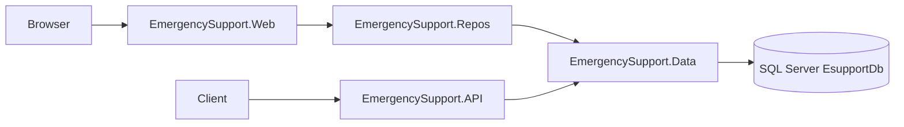

# Emergency-Support-System


Web application for managing emergency requests, responders, assignments, notifications, feedback, and activity logs. The solution includes an ASP.NET Core MVC site for day-to-day use and a separate Web API project that exposes CRUD endpoints for selected entities.

## Overview

Users sign up, log in, and work through Razor views backed by repository classes and Entity Framework Core. Emergency requests store location coordinates, type, description, status, and priority. Operators and responders can update request status; operators can set priority levels. Assignments link requests to responders. Feedback can be submitted for completed requests.

The API project shares the same SQL Server database and exposes CRUD endpoints for selected modules.

## Features

**MVC (`EmergencySupport.Web`)**

- User registration and cookie-based login
- Emergency requests: list, create, edit, delete (own requests only)
- Request status updates (`Assigned`, `Completed`) for `emergency operator` and `responder`
- Priority updates (`Low`, `Medium`, `High`) for `emergency operator`
- Responders: list, create, edit, delete (users with `responder` role)
- Assignments: list, create, delete
- Notifications: list, create, edit, delete
- Feedback: list, create, edit, delete (completed requests only for new feedback)
- Reports logs: list and delete (`emergency operator` only)

**Web API (`EmergencySupport.API`)**

- `Users` — GET all, GET by id, POST (create/update), DELETE
- `Responders` — GET all, GET by id, POST (create/update), DELETE
- `ReportsLogs` — GET all, GET by id, POST (create/update), DELETE

## Tech Stack

| Layer | Technology |
|-------|------------|
| MVC app | ASP.NET Core 8 MVC, Razor Views |
| API | ASP.NET Core 8 Web API, Swagger (Swashbuckle 6.6.2) |
| ORM | Entity Framework Core 8.0.24 |
| Database | SQL Server |
| UI | Bootstrap (superhero theme), Bootstrap Icons (CDN), jQuery Validation |

## Solution Structure

```
EmergencySupport.Web.sln
├── EmergencySupport.Web/          # MVC application
├── EmergencySupport.API/          # Web API
├── EmergencySupport.Data/         # EsupportDbContext
├── EmergencySupport.Entities/     # Entity classes
├── EmergencySupport.Repos/        # Repository classes (used by MVC)
├── EmergencySupport.Models/       # LoginModel
└── EmergencySupport.Shared/       # Result<T>, CurrentUserHelper
```



The MVC app calls repositories, which use `EsupportDbContext`. The API uses the same `DbContext` without the repository layer.

## Database

Database name: **EsupportDb**

| Table | Purpose |
|-------|---------|
| Users | Accounts (name, email, password, phone, role, address) |
| EmergencyRequests | Requests with type, description, coordinates, priority, status |
| Responders | Responder profile linked to a user (service type, availability, location) |
| Assignments | Links a request to a responder with status and timestamps |
| Notifications | User notifications (message, type, read flag) |
| Feedback | Rating and comments for a completed request |
| ReportsLogs | User action logs |

There are no EF Core migrations in this repository. The database and tables must already exist and match the entity definitions in `EmergencySupport.Entities`.

Default connection string (both projects):

```
Data Source=localhost\SQLEXPRESS01;Initial Catalog=EsupportDb;TrustServerCertificate=True;Integrated Security=True;
```

Update `ConnectionStrings:EsupportDb` in:

- `EmergencySupport.Web/appsettings.json`
- `EmergencySupport.API/appsettings.json`

## Authentication

**MVC**

- Cookie authentication scheme: `EsAuth`
- Login: `/Auth/Login` — Access denied: `/Auth/Denied`
- Session cookie expires after 30 minutes
- Sign-up roles: `admin`, `user`, `emergency operator`, `responder`
- Most controllers require `[Authorize]`; some actions restrict by role

| Role | Examples |
|------|----------|
| `user` | Create/edit/delete own emergency requests; submit feedback |
| `emergency operator` | Set request priority; update status; view/delete reports |
| `responder` | Update request status; manage responders and assignments |
| `admin` | Access responders and assignments controllers |

Authentication is implemented using custom cookie-based authentication and role claims.

**API**

- No authentication or authorization configured on API controllers

## Prerequisites

- [.NET 8 SDK](https://dotnet.microsoft.com/download/dotnet/8.0)
- SQL Server (local instance; default config uses `localhost\SQLEXPRESS01`)
- Database `EsupportDb` with tables matching the entity models

## Setup

From the solution root (folder containing `EmergencySupport.Web.sln`):

```bash
dotnet restore EmergencySupport.Web.sln
```

Set the SQL Server connection string in both `appsettings.json` files if your instance differs from the default.

## Running the Application

Run the MVC site and API in separate terminals.

**MVC**

```bash
dotnet run --project EmergencySupport.Web
```

Development URLs (`EmergencySupport.Web/Properties/launchSettings.json`):

- HTTPS: `https://localhost:7019`
- HTTP: `http://localhost:5001`

**API**

```bash
dotnet run --project EmergencySupport.API
```

Development URLs (`EmergencySupport.API/Properties/launchSettings.json`):

- HTTPS: `https://localhost:7137`
- HTTP: `http://localhost:5138`
- Swagger UI: `/swagger` (Development only)

Register a user at `/Auth/Signup`, then log in at `/Auth/Login`.

## API Endpoints

Base route: `api/[controller]`

### Users

| Method | Route | Description |
|--------|-------|-------------|
| GET | `api/Users/getUsers` | All users |
| GET | `api/Users/byID/{id}` | User by id |
| POST | `api/Users` | Create or update user |
| DELETE | `api/Users/{id}` | Delete user |

### Responders

| Method | Route | Description |
|--------|-------|-------------|
| GET | `api/Responders/getResponders` | All responders |
| GET | `api/Responders/byID/{id}` | Responder by id |
| POST | `api/Responders` | Create or update responder |
| DELETE | `api/Responders/{id}` | Delete responder |

### ReportsLogs

| Method | Route | Description |
|--------|-------|-------------|
| GET | `api/ReportsLogs/getReports` | All report logs |
| GET | `api/ReportsLogs/byID/{id}` | Log by id |
| POST | `api/ReportsLogs` | Create or update log |
| DELETE | `api/ReportsLogs/{id}` | Delete log |


## License

This project is intended for educational purposes.
